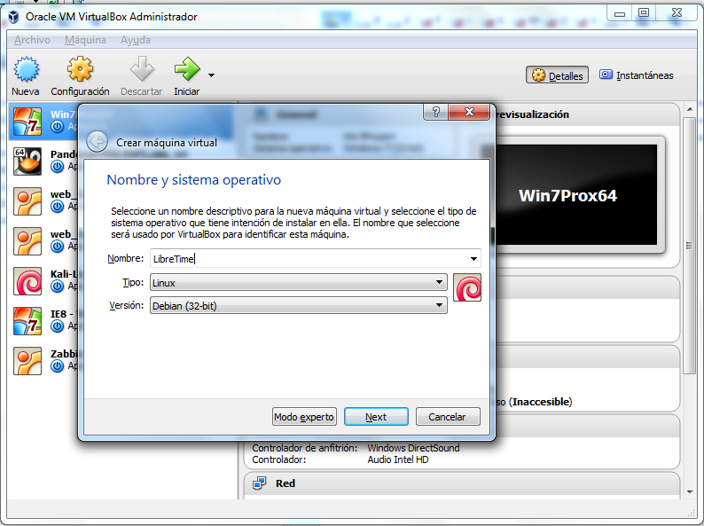
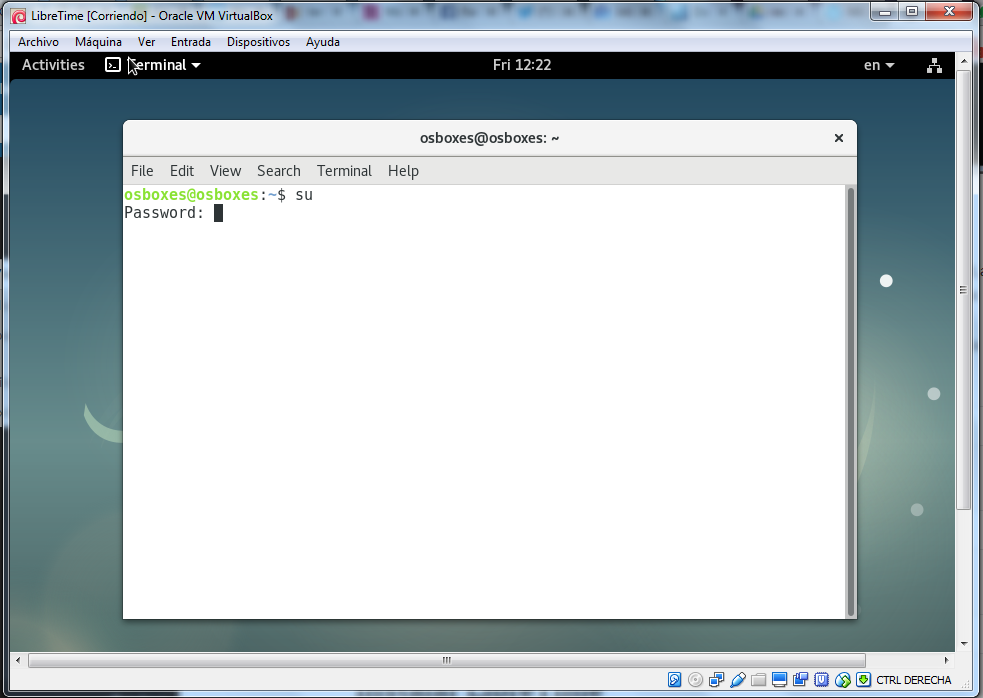
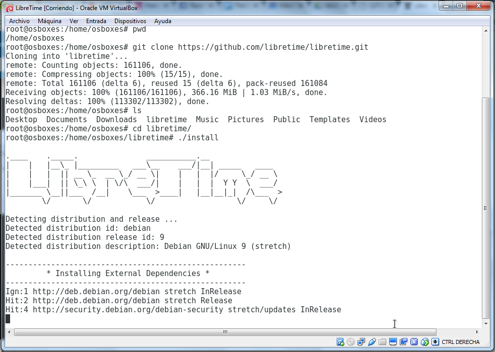
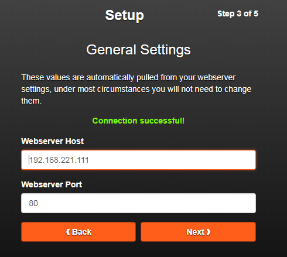
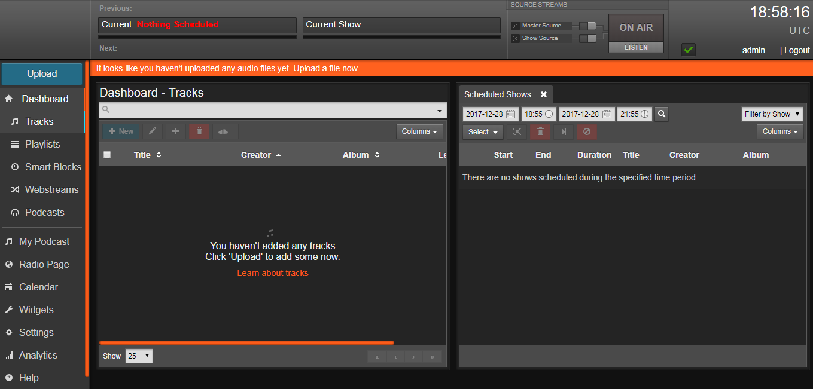

Este manual tiene como propósito dar algunas indicaciones generales para montar un entorno virtualizado en [Debian](https://www.debian.org/index.es.html) con una **instalación básica de Airtime para realizar pruebas**. La maquina usada como anfitrión es MS Windows 7 pero en teoría usando [VirtualBox](https://www.virtualbox.org/) se puede hacer sobre cualquier otro sistema operativo. 

Para poder seguir el manual se requiere algún nivel técnico ya que en muchos casos no entra al detalle de temas como Debian o Linux (o asistir al taller presencial). 

# Creando la láquina virtual 


Para crear la máquina virtual en un equipo con Windows 7 usaremos la aplicación [**VirtualBox**](https://www.virtualbox.org/), así que lo primero es bajar la aplicación e instalarla (yo tengo instalada la Versión 5.1.10 r112026 (Qt5.6.2)). Si usas un sistema operativo Linux,OS X o Windows no deberías tener problemas para instalar VirtualBox por primera vez, **VirtualBox** es multiplataforma y funciona muy bien, salvo los primeros pasos el resto será parecido en cualquier otro sistema operativo.

Descarga [VirtualBox-5.2.4-119785-Win.exe](http://bit.ly/2ljC3oI) para MS Windows (Google Drive).

Despues para ahorrar tiempo **bajaremos una imagen de Ubuntu o Debian reparada para VirtualBox**. En estos enlaces se pueden descargar diferentes versiones: [OSBoxes.org](http://www.osboxes.org/), [VirtualBoxes.org](https://virtualboxes.org/).

Esta distribución de Ubuntu por ejemplo es una de las que recomiendan en el propio manual de [LibreTime](http://libretime.org/manual/preparing-the-server/)
 [Ubuntu_16.04.3-VB-32bit.7z (1.0G)](https://drive.google.com/file/d/0B_HAFnYs6Ur-N0d2MGMxWGI5Uzg/view?usp=sharing) (Username: osboxes, password: osboxes.org).

Yo voy a probar con [**Debian 9.1 Stretch**](https://www.debian.org/News/2017/20170722) descargado de [OSBoxes.org](http://www.osboxes.org/debian/) como "Debian_9.1.0-VB-32bit.7z" comprimido con [7-Zip](http://www.7-zip.org/). Usuario: osboxes, clave: osboxes.org, Root Account Password: osboxes.org.

Los archivos con extensón VDI como "Debian 9.1.0 (32bit).vdi" o otros que queramos importar en Virtual Box es una imagen de un disco duro, por eso antes de empezar hay que crear una nueva maquina virtual. En el menú principal de Virtual Box seleccionamos Máquina > Nueva. 



En la siguiente pantalla asignamos la memoria RAM que se dedicará a la máquina virtual (mínimo 1GB recomendable). 

En el momento de seleccionar el disco duro debemos agregar uno existente (el archivo "Debian 9.1.0 (32bit).vdi" descargado y descomprimido previamente).  


Ya estamos preparados para arrancar nuestra máquina virtual con Debian.


# Algunos pasos previos en Debian  

Desde el primer momento el gestor de paquetes apt me ha dado problemas instalando Git, al final no he tenido más remedio que editar `# nano /etc/apt/sources.list` y agregar la siguiente línea:

He abierto un terminal de comandos y me he logeado como administrador con `su` (solicita contraseña "osboxes.org")



Ahora instalo el cliente [Git](https://git-scm.com/) para clonar el repositorio [LibreTime](https://github.com/LibreTime/libretime) de GitHub:

```
# apt-get install git
```

Tengo un problema, el sistema me solicita que inserte el DVD de Debian para buscar los paquetes necesarios, cancelo la operación.

Edito el fichero que contiene los repositorios donde Debian busca para instalar las aplicaciones `# nano /etc/apt/sources.list`. La línea donde hace referencia al cdrom debemos comentarla escribiendo un '#' por delante (para familiarizarse con el editor de textos Nano dejo algunos enlaces en [Enlaces externos](libretime_y_virtualbox.md#enlaces-externos)).


Volvemos a tratar de instalar Git (`# apt-get install git`) pero en esta ocasión se produce un error de dependencias.


Voy a añadir dos nuevas líneas a `# nano /etc/apt/sources.list`:

```
deb  http://deb.debian.org/debian  stretch main
deb-src  http://deb.debian.org/debian  stretch main
```


Y después he ejecutado en la línea de comandos:
```
# apt update && apt upgrade
```

Para actualizar con la información de los nuevos repositorios y para actualizar las versiones de los paquetes que tenemos instalados en Debian.


Ahora ya puedo instalar Git:

```
# apt-get install git
```

# Instalar LibreTime

Ahora voy a clonar el repositorio [LibreTime en GitHub](https://github.com/libretime/libretime.git).

```
# git clone https://github.com/libretime/libretime.git
```

Cuando se descargue LibreTime accedo a la carpeta y ejecuto el script `# ./install`. 



Durante la instalación configura:

* Apache
* IceCast
* PHP
* PostreSQL
* RabbitMQ 

y el resto de paquetes necesarios.

Por el momento una vez finalizada la instalación sólo puedo a [Icecast](http://icecast.org/) en [http://localhost:8000](http://localhost:8000) y a página de instalación de Airtime en [http://localhost](http://localhost), he dejado todos los parámetros como estaban (con "airtime") y he seleccionado continuar.




Con algunos errores pero se ha instalado y se puede abrir en [http://localhost](http://localhost).


Ahora ya puedo acceder desde mi maquina anfitrión a LibreTime en [http://192.168.221.103/](http://192.168.221.103/) (usuario: admin, clave: admin).



# Enlaces externos

* Web principal con documentación [http://libretime.org/](http://libretime.org/).
* Repositorio en [GitHub](https://github.com/LibreTime/libretime/).

Editor **Nano**:

* [https://www.nanotutoriales.com/tutorial-del-editor-de-texto-nano](https://www.nanotutoriales.com/tutorial-del-editor-de-texto-nano).
* [https://www.atareao.es/software/programacion/nano-un-editor-de-texto-para-la-terminal/](https://www.atareao.es/software/programacion/nano-un-editor-de-texto-para-la-terminal/).