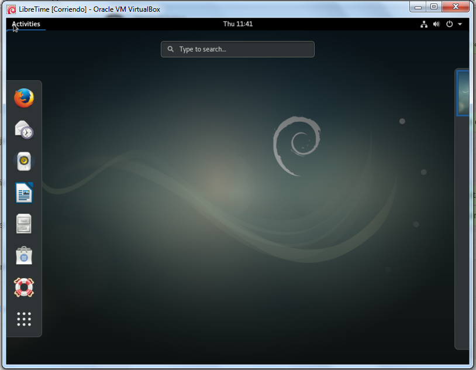
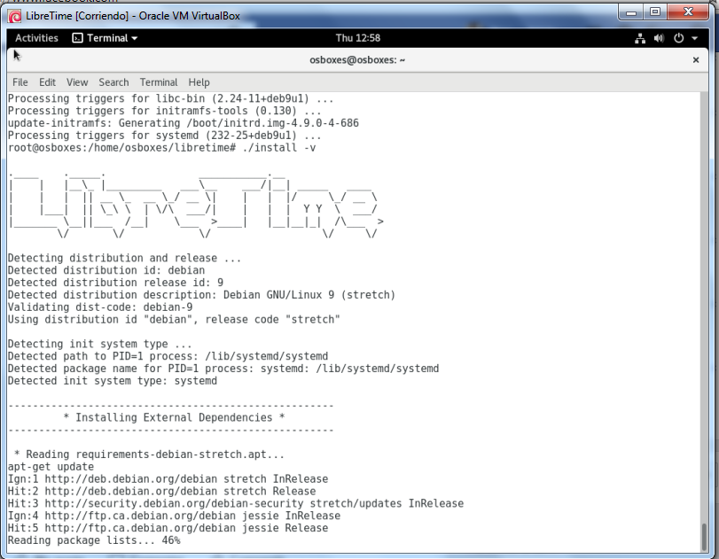

# Máquina virtual


Para crear la máquina virtual en un equipo con Windows 7 usaremos la aplicación [**VirtualBox**](https://www.virtualbox.org/), así que lo primero es bajar la aplicación e instalarla (yo tengo instalada la Versión 5.1.10 r112026 (Qt5.6.2)).

Despues para ahorrar tiempo bajaremos una imagen de Ubuntu o Debian reparada para VirtualBox. En estos enlaces se pueden descargar diferentes versiones.

* [http://www.osboxes.org/ubuntu/](http://www.osboxes.org/ubuntu/)
* [https://virtualboxes.org/images/ubuntu-server/](https://virtualboxes.org/images/ubuntu-server/)

Esta distribución es una de las que recomiendan en el propio manual de [LibreTime](http://libretime.org/manual/preparing-the-server/)
[Ubuntu_16.04.3-VB-32bit.7z (1.0G)](https://drive.google.com/file/d/0B_HAFnYs6Ur-N0d2MGMxWGI5Uzg/view?usp=sharing) (Username: osboxes, password: osboxes.org).


Yo voy a probar con [**Debian 9.1 Stretch**] descargado de [OSBoxes.org](http://www.osboxes.org/debian/) como "Debian 9.1.0 (32bit).vdi"(Username: osboxes, Password: osboxes.org, Root Account Password: osboxes.org).



Desde el primer momento el gestor de paquetes apt me ha dado problemas instalando Git, al final no he tenido más remedio que editar `# nano /etc/apt/sources.list` y agregar la siguiente línea:

```
deb http://ftp.ca.debian.org/debian/ jessie main contrib
```

Y después actualizar el sistema:
```
# apt-get update && apt-get upgrade && apt-get dist-upgrade
``` 

Ahora ya puedo instalar Git:

```
# apt-get install git
```

# Instalar LibreTime

Ahora voy a clonar el repositorio [LibreTime en GitHub](https://github.com/libretime/libretime.git).

```
# git clone https://github.com/libretime/libretime.git
```

Cuando se descargue LibreTime accedo a la carpeta y ejecuto el script `# ./install`. Comienza el proceso de instalación pero hay problemas de dependencias no resueltas con Apache y PHP. He añadido las dos siguientes líneas a `/etc/apt/sources.list`:

```
deb  http://deb.debian.org/debian  stretch main
deb-src  http://deb.debian.org/debian  stretch main
```
Y después he ejecutado
```
# apt update && apt upgrade
```

Vuelvo a ejecutar el script de instalación `./install`. 



Parece que ahora funciona correctamente. Durante la instalación configura Apache, IceCast, PHP, PostreSQL, RabbitMQ y el resto de paquetes necesarios.

Por el momento una vez finalizada la instalación sólo puedo a [Icecast](http://icecast.org/) en [http://localhost:8000](http://localhost:8000) y a página de instalación de Airtime en [http://localhost](http://localhost), he dejado todos los parámetros como estaban (con "airtime") y he seleccionado continuar.


Con algunos errores pero se ha instalado y se puede abrir en [http://localhost](http://localhost).


Ahora ya puedo acceder desde mi maquina anfitrión a LibreTime en [http://192.168.221.103/](http://192.168.221.103/) (usuario: admin, clave: admin).

