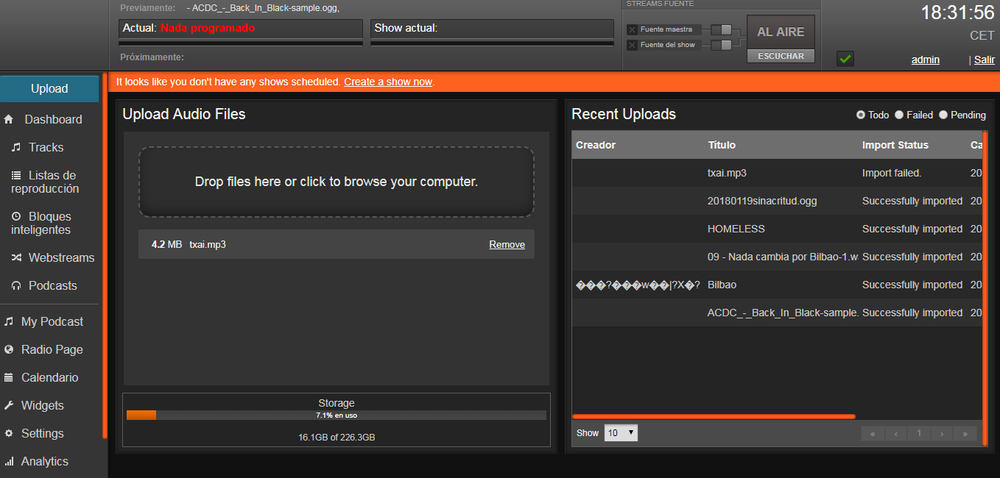
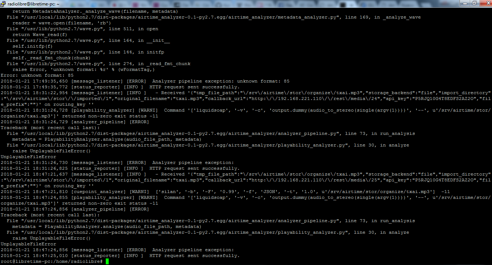

# No importa archivos mp3

Por alguna razón la máquina virtual reconoce los formatos de audio mp3 y [ogg](https://es.wikipedia.org/wiki/Ogg) y sin embargo en el servidor montando en la computadora sólo permite importar archivos ogg. La versión de LibreTime está bajada de GitHub sin embargo Debian 9 se ha instalado de diferentes formas (para la máquina virtual se ha descargado una imagen creada de osboxes.org y para la computadora se ha partido de una imagen ISO bajada del repositorio oficial.



Es probable que el problema resida en los codecs mp3 que no son reconocidos pero he probado y puedo reproducir una muestra mp3 en el servidor usando VLC. Analizando los logs se aprecia el error, parece que el responsable es el comando `liquidsoap`.



Obtener versión de liquidsoap `# liquidsoap --version` es v.1.1.1.

Los archivos mp3 realmente son almacenados en una ruta intermedia `/srv/airtime/stor/organize/` pero por alguna razón luego no se mueven al destino final donde los almacena en ` /srv/airtime/stor/imported/` (los ogg si).

En algunos foros recomiendan que pruebes el archivo desde línea de comandos:

```
# liquidsoap --verbose --debug -c 'output.dummy(audio_to_stereo(single("/srv/airtime/stor/organize/txai.mp3")))'
```

Produce en mi caso un error de segmentación, parece que en Debian 9 esa versión de liquidsoap falla en la importación de mp3..


Enlaces:

* GitHub LibreTime issues: [Upload of mp3 and ogg files fail on debian jessie #352](https://github.com/LibreTime/libretime/issues/352) [Airtime Analyzer mp3 import fails on some Debian installs #380](https://github.com/LibreTime/libretime/issues/380) [Problem: We want to upgrade to Liquidsoap 1.3.0 #192](https://github.com/LibreTime/libretime/issues/192).

# Ventana emergente 